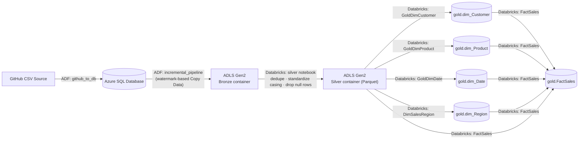
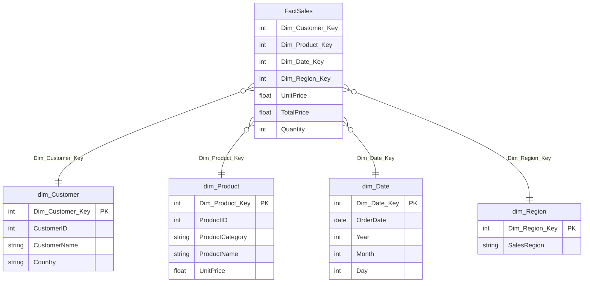

# Azure End-to-End Data Engineering Project — Sales Analytics (Medallion Architecture)

An end-to-end batch data pipeline built on **Azure Data Factory**, **Azure Databricks (PySpark)**, **Azure Data Lake Storage Gen2**, and **Azure SQL Database**, following the **Bronze → Silver → Gold (Medallion)** architecture and landing in a **star schema** for reporting.

---

## 1. Architecture



Orchestration is handled entirely by one ADF pipeline (`Final_Pipeline`): a **Silver** notebook activity runs first, and on success it fans out into **four parallel dimension-build notebooks** (Customer, Product, Date, Region). Once all four succeed, a **FactSales** notebook joins everything into the fact table.

---

## 2. Azure Resources

All resources live in resource group **`project-1-re`** (Central India).

| Resource | Name | Purpose |
|---|---|---|
| Data Factory (V2) | `adfprore-1` | Orchestration — ingestion, incremental loads, notebook pipeline |
| Azure SQL Server / Database | `pro-re--server` / `prore` | Staging store for raw source data pulled from GitHub |
| ADLS Gen2 Storage Account | `projectstorageacc2` | Data lake — `bronze`, `silver`, `gold` containers |
| Azure Databricks Service | `redatabricks` | PySpark transformation, SCD upserts, Delta Lake |

Storage containers (`projectstorageacc2`):

| Container | Contents |
|---|---|
| `bronze` | Raw data copied from the SQL DB, as Parquet |
| `silver` | Cleaned, deduplicated, standardized Parquet |
| `gold` | Delta tables — 4 dimensions + fact table |

---

## 3. Data Factory Pipelines

### 3.1 `github_to_db`
Initial/full load pipeline — copies the raw source dataset (hosted on GitHub) into the Azure SQL Database, which acts as the system-of-record staging layer for downstream extraction.

### 3.2 `incremental_pipeline`
Implements a **watermark-based incremental load** pattern:

1. **Lookup — `last_date`**: reads the last successfully processed date from a watermark ("dateholder") table.
2. **Lookup — `max_date`**: reads the maximum date currently available in the source.
3. **Copy Data — `new_data`**: copies only rows between `last_date` and `max_date` from the SQL DB into the data lake.
4. **Stored Procedure — `update dateholder`**: after a successful copy, updates the watermark table with the new `max_date`, so the next run only picks up newer records.

This means re-runs are idempotent and cheap — only new/changed rows since the last run are pulled.

### 3.3 `Final_Pipeline`
The main orchestrator, triggered after the bronze data lands:

```
Silver (Notebook)
   ├──▶ DimCustomer (Notebook)  ─┐
   ├──▶ DimDate (Notebook)      ─┤
   ├──▶ DimProduct (Notebook)   ─┼──▶ FactSales (Notebook)
   └──▶ DimSalesRegion (Notebook)┘
```

The dimension notebooks run in parallel since none of them depend on each other — they all read from the same Silver dataset. `FactSales` waits on all four before running, since it needs every dimension's surrogate keys to build the fact rows.

---

## 4. Databricks Notebooks

### 4.1 `silver` — Bronze → Silver
- Reads the latest Parquet file landed in the `bronze` container.
- `dropDuplicates()` to remove exact duplicate rows.
- Standardizes text casing with `initcap()` on `CustomerName`, `ProductName`, `ProductCategory`, `Country`, and `SalesRegion` (fixes inconsistent casing from the source).
- `dropna(how='all')` removes fully-empty rows.
- Writes the cleaned dataset to the `silver` container as Parquet (`mode('overwrite')`).

### 4.2 `GoldDimCustomer`, `GoldDimProduct`, `GoldDimDate`, `DimSalesRegion` — Silver → Gold Dimensions
All four dimension notebooks follow the **same SCD Type‑1 (upsert, no history) pattern**:

1. Read a `dbutils.widgets` parameter `incremental flag` — `'0'` means first/full load, anything else means incremental.
2. Pull distinct dimension attributes from the silver dataset (e.g. `CustomerID`, `CustomerName`, `Country` for the customer dimension; `Year`/`Month`/`Day` derived from `OrderDate` for the date dimension).
3. Read the existing Gold Delta table if it exists (`df_sink`); if not, create an empty DataFrame with the same schema (`where 1=2` trick, or `spark.createDataFrame([], schema=...)`).
4. **Left join** source vs. sink on the natural/business key to split into:
   - `df_old` — rows that already have a surrogate key.
   - `df_new` — brand-new rows with no surrogate key yet.
5. Compute the next surrogate key value:
   - First load (`incremental_flag == '0'`) → start at `1`.
   - Otherwise → `MAX(existing surrogate key) + monotonically_increasing_id()` for the new rows only.
6. `df_old.union(df)` to recombine old (unchanged) and newly-keyed rows.
7. **Upsert into the Gold Delta table** using `DeltaTable.merge()`:
   - `whenMatchedUpdateAll()` — refreshes attributes for existing keys.
   - `whenNotMatchedInsertAll()` — inserts new dimension members.
   - If the Delta table doesn't exist yet, does an initial `overwrite` write instead.

Resulting Gold dimension tables: `gold.dim_Customer`, `gold.dim_Product`, `gold.dim_Date`, `gold.dim_Region`.

### 4.3 `FactSales` — Gold Fact Table
- Reads all four Gold dimension Delta tables plus the Silver dataset.
- Joins Silver to each dimension on its business key (`CustomerID`, `ProductID`, `OrderDate`, `SalesRegion`) to resolve each row's **surrogate keys**.
- Selects the four dimension surrogate keys (`Dim_Customer_Key`, `Dim_Product_Key`, `Dim_Date_Key`, `Dim_Region_Key`) alongside the measures `UnitPrice`, `TotalPrice`, and `Quantity` — producing a clean **star schema fact table** ready for BI tools (Power BI / Looker Studio).

---

## 5. Star Schema



---

## 6. Tech Stack

- **Ingestion / Orchestration:** Azure Data Factory (Copy Data, Lookup, Stored Procedure, Notebook activities)
- **Storage:** Azure Data Lake Storage Gen2 (hierarchical namespace, bronze/silver/gold containers)
- **Staging:** Azure SQL Database
- **Transformation:** Azure Databricks, PySpark, Delta Lake (`DeltaTable.merge` for upserts)
- **Pattern:** Medallion Architecture (Bronze/Silver/Gold) + Kimball-style Star Schema + SCD Type‑1 dimensions + watermark-based incremental loading

---

## 7. Repository Structure

```
├── adf/
│   ├── github_to_db.json          # Full load: GitHub source → Azure SQL DB
│   ├── incremental_pipeline.json  # Watermark-based incremental Copy Data
│   └── Final_Pipeline.json        # Orchestrates Silver → 4 Dims → FactSales
├── notebooks/
│   ├── silver.ipynb                # Bronze → Silver cleaning
│   ├── GoldDimCustomer.ipynb       # SCD1 upsert — customer dimension
│   ├── GoldDimProduct.ipynb        # SCD1 upsert — product dimension
│   ├── GoldDimDate.ipynb           # SCD1 upsert — date dimension
│   ├── DimSalesRegion.ipynb        # SCD1 upsert — region dimension
│   └── FactSales.ipynb             # Gold fact table build
└── README.md
```

## 8. Setup Notes

1. Provision the resources listed in [section 2](#2-azure-resources) (or equivalents) in your own subscription.
2. Store the ADLS Gen2 access key in a **Databricks secret scope backed by Azure Key Vault** rather than in notebook code — see the security note below.
3. Create the widget parameter `incremental flag` on each Gold notebook (`'0'` for the first run, `'1'` for subsequent incremental runs), and wire it as a pipeline parameter in ADF.
4. Run `github_to_db` once to seed the SQL DB, then schedule `incremental_pipeline` → `Final_Pipeline` on a trigger.

> **Security note:** The original notebook exports had the ADLS access key hardcoded via `spark.conf.set(...)`. Before publishing code publicly, replace this with `dbutils.secrets.get(scope="<scope>", key="<key-name>")`, and rotate any key that was ever committed in plaintext.
